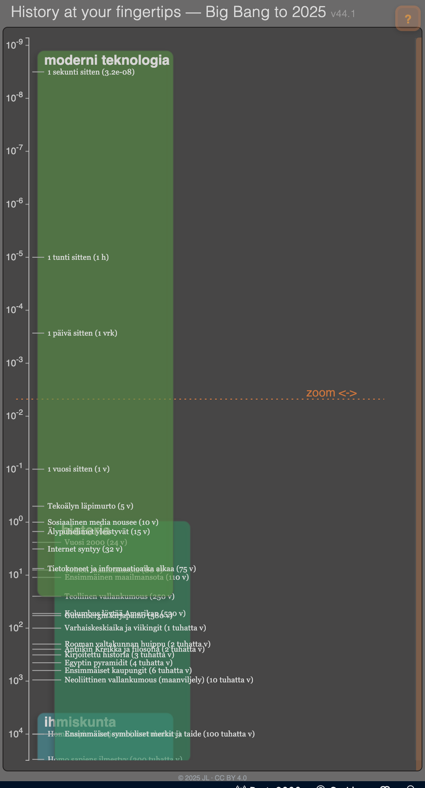

# README45.md — Present Overlay & Observer Time  
*(“Scroll to the Present” edition)*

## 1. Overview

Version 45 introduces a unified foundation for the **present-moment interface** of the logarithmic timeline.  
The goal is to make the **present** a first-class, navigable region — a “living surface” of real time that the user can reach simply by scrolling down.

This version consolidates three architectural pieces:

1. **Absolute-year event data**  
   All historical events are expressed as absolute years (BCE / CE), guaranteeing stability over decades.

2. **Observer Time engine**  
   A small controller that defines what “now” means — system time, fixed time, or simulated play-time — with configurable granularity.

3. **Present Overlay**  
   A lightweight, non-interactive visual layer that displays the current clock region and, later, a live feed of near-real-time events.

---
<p align="center">
  
  <br>
  <em>Figure 1 — Present overlay region near the wall-clock end of the timeline.  
  The user scrolls down to reach this area, where seconds, minutes, and recent events unfold.</em>
</p>

## 2. Data model

### 2.1 Absolute years
- Each event stores an absolute `year` (decimal, positive = CE, negative = BCE).  
- The timeline will continue to display these correctly no matter when the viewer opens the page.

### 2.2 Legacy migration
If a record only contains approximate ages (e.g. `ago_years`):

```js
year = TS_CFG.referenceYear - event.ago_years;
event.approx = true;
```

`TS_CFG.referenceYear` is fixed (e.g. 2025.0) and used only during normalization; the JSON file itself is never rewritten.

### 2.3 Relative text
Labels such as “2 000 years ago” are **render-time calculations**, derived from:

```
ageYears = observerNowDecimalYear − event.year
```

They are not stored in the database.

---

## 3. Observer Time Engine

### 3.1 Purpose
Centralizes all access to “current time” for overlays and relative labels.  
Everything else uses this instead of `Date.now()`.

### 3.2 State
| Field | Meaning |
|-------|----------|
| `mode` | `'system' | 'fixed' | 'play'` |
| `granularity` | `'100ms' – '1h'` etc. |
| `observerNow` | Effective current time |
| `rate` | Playback rate in play mode |

### 3.3 Modes
- **System** – follows real system clock, snapped to granularity.  
- **Fixed** – locked to a chosen date (via config or URL `?view=2030`).  
- **Play** – advances at custom rate; can scrub forward/backward.

### 3.4 Granularity
Defines update frequency and marker density (e.g. 100 ms, 1 s, 1 min).  
The engine publishes a new `observerNow` only when the rounded “bucket” changes, avoiding redundant redraws.

---

## 4. Present Overlay (static v45)

### 4.1 Purpose
Visualizes the “surface of now” — thin clock lines and short labels showing the current observer time and recent boundaries.

### 4.2 Structure
- Separate SVG group: `<g id="present-overlay" class="present-layer" pointer-events="none">`
- Draws:
  - **Snapshot** at `T₀ = getObserverNow()`  
  - **Aligned markers before T₀:** last minute, hour, day

### 4.3 Behavior
- **Static v45:** timestamps fixed at page load; only positions recompute on scroll / resize.  
- **Dynamic future:** driven by observer-time ticks (granularity-based), animating smoothly without touching event data.

---

## 5. UX Design Intent — “Scroll to the Present”

### 5.1 Concept
The **bottom of the timeline** is the **present moment** — an asymptote where time meets the observer.  
Scrolling **downward** brings the user closer to now; zoom adjusts local resolution but not direction.

### 5.2 Scrolling experience
- Scrolling **down** expands the log scale near the present, revealing finer temporal detail.  
- The upper (historical) region compresses naturally.  
- At the lowest point, the user enters the **wall-clock region**.

> *Developer note:*  
> Scroll controls the visible time window; zoom controls resolution within it.  
> Both affect how densely overlay markers and near-present events are drawn.

### 5.3 Wall-clock region
- Thin lines + labels (`HH:MM:SS.mmm`, `:00 min`, `:00 hour`, `Today`)  
- The line at `observerNow` marks the **exact present**.  
- Always passive; no interaction.

### 5.4 Zoom–scroll interplay
- **Zoom out:** shows more context and a broader near-present feed zone.  
- **Zoom in:** increases precision, stretching short intervals.  
- Feed and overlay density adapt automatically based on pixel spacing.

### 5.5 Extending into live feed
- Future versions may inject **near-real-time events** just above the clock:  
  news, data streams, or “moments since page load.”  
- Each carries its own timestamp and moves downward as time passes.  
- The overlay thus becomes a **living feed** where new items appear at now and fade into history.

### 5.6 Continuity
The same vertical scroll connects milliseconds to billions of years —  
a seamless motion from *now* to the deep past.

### 5.7 User journey

| Action | Effect | System behavior |
|--------|---------|----------------|
| Scroll down | Approach the present | Log scale expands; clock overlay appears |
| Reach bottom | Enter wall-clock region | Fine-grained markers visible |
| Stay at bottom | Observe real time | Overlay updates via Observer Time |
| Scroll up | Move into history | Scale compresses; overlay fades |
| Lock observer (Fixed) | Simulate another epoch | Overlay freezes; relative labels recalc |
| Enable live feed | Stream new events | Real-time items flow below the clock |

---

## 6. Implementation roadmap

1. **Normalize data** → ensure all items have absolute `year`.  
2. **Add Observer Time engine** (`getObserverNow`, granularity scheduler).  
3. **Render Present Overlay** at init (`T₀` snapshot) with lines + labels.  
4. **Relayout** overlay on scroll / resize only (no animation yet).  
5. **Optional:** add “fixed time” URL param for simulation (e.g., `?view=2030`).  
6. **Later:** enable dynamic overlay + near-real-time feed.

---

## 7. Acceptance criteria

- Events remain stable at absolute years across all modes.  
- Present overlay visible and correctly positioned at the bottom.  
- No interaction conflicts with existing event layers.  
- Relative labels and simulation (`fixed mode`) work.  
- Architecture ready for real-time extension.

---

## 8. Vision beyond v45

> A single, continuous scroll connects **all of history to the present**.  
> The **present overlay** becomes the gateway to live time.  
> In future versions, this same structure will host dynamic data streams, letting users watch the unfolding moment in the same spatial continuum as the ancient past.
